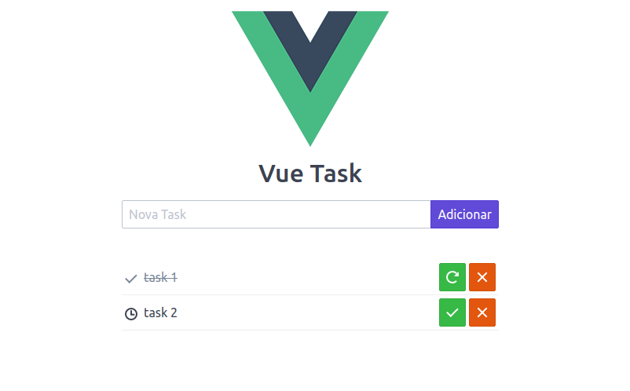

<h1 align="center">
  
  <br>
</h1>

## :thinking: About
This project is a simple and objective task manager made with Vue.JS that uses local storage to store information.

## :rocket: Technologies
This project was developed with the following technologies:

- [Vue CLI](https://cli.vuejs.org/)
- [Eslint](https://github.com/eslint/eslint)
- [Spectre CSS](https://picturepan2.github.io/spectre/)

## Project setup
```
yarn install
```

### Compiles and hot-reloads for development
```
yarn serve
```

### Compiles and minifies for production
```
yarn build
```

### Lints and fixes files
```
yarn lint
```

### Customize configuration
See [Configuration Reference](https://cli.vuejs.org/config/).


## :memo: License
MIT
